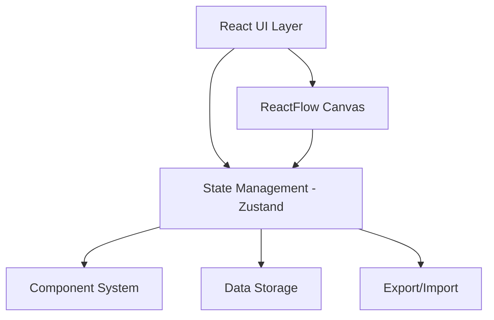

# 設計文書

## 概要

Reactflowを使用した機材結線図作成ツールの技術設計です。Unityスタイルのオブジェクト・コンポーネントシステムを採用し、視覚的な結線図とテーブル形式の双方向編集を実現します。

## アーキテクチャ

### システム構成



### 主要モジュール

- **Canvas Module**: ReactFlowベースの図形描画・編集
- **Component System**: オブジェクト・コンポーネント管理
- **Table Editor**: 結線情報のテーブル形式編集
- **Template Library**: 機材テンプレート管理
- **Import/Export**: ファイル入出力機能

## データモデル

### 1. 機材オブジェクト (EquipmentObject)

```typescript
interface EquipmentObject {
  id: string;
  name: string;
  position: { x: number; y: number };
  rotation: number;
  scale: { x: number; y: number };
  components: Component[];
  templateId?: string; // 元となったテンプレートID
  metadata: Record<string, any>;
}
```

### 2. コンポーネントシステム

#### 基底コンポーネント
```typescript
interface Component {
  id: string;
  type: ComponentType;
  enabled: boolean;
  data: Record<string, any>;
}

enum ComponentType {
  RENDER = 'render',
  CONNECTION_PORT = 'connectionPort',
  PROPERTY = 'property',
  TRANSFORM = 'transform'
}
```

#### 描画コンポーネント
```typescript
interface RenderComponent extends Component {
  type: ComponentType.RENDER;
  data: {
    shape: ShapeType;
    color: string;
    strokeColor: string;
    strokeWidth: number;
    size: { width: number; height: number };
    svgIcon?: string; // SVGパス文字列
    label?: {
      text: string;
      position: LabelPosition;
      fontSize: number;
      color: string;
    };
  };
}

enum ShapeType {
  RECTANGLE = 'rectangle',
  CIRCLE = 'circle',
  TRIANGLE = 'triangle',
  POLYGON = 'polygon',
  CUSTOM_SVG = 'customSvg'
}

enum LabelPosition {
  TOP = 'top',
  BOTTOM = 'bottom',
  LEFT = 'left',
  RIGHT = 'right',
  CENTER = 'center'
}
```

#### 接続ポートコンポーネント
```typescript
interface ConnectionPortComponent extends Component {
  type: ComponentType.CONNECTION_PORT;
  data: {
    portType: PortType;
    direction: PortDirection;
    position: PortPosition;
    constraints: PortConstraints;
    connectedWires: string[]; // 接続されているワイヤーのID配列
    label?: string;
  };
}

enum PortType {
  POWER = 'power',
  SIGNAL = 'signal',
  DATA = 'data',
  GROUND = 'ground',
  CUSTOM = 'custom'
}

enum PortDirection {
  INPUT = 'input',
  OUTPUT = 'output',
  BIDIRECTIONAL = 'bidirectional'
}

interface PortPosition {
  side: Side; // 図形のどの辺に配置するか
  offset: number; // 辺の長さに対するパーセンテージ (0-100)
  absoluteOffset?: number; // 絶対座標でのオフセット
}

enum Side {
  TOP = 'top',
  RIGHT = 'right',
  BOTTOM = 'bottom',
  LEFT = 'left'
}

interface PortConstraints {
  maxConnections: number; // 最大接続数
  allowedPortTypes: PortType[]; // 接続可能なポートタイプ
  allowedDirections: PortDirection[]; // 接続可能な方向
}
```

#### プロパティコンポーネント
```typescript
interface PropertyComponent extends Component {
  type: ComponentType.PROPERTY;
  data: {
    properties: Record<string, PropertyValue>;
    schema: PropertySchema[];
  };
}

interface PropertyValue {
  value: any;
  type: PropertyValueType;
  displayName: string;
  description?: string;
}

enum PropertyValueType {
  STRING = 'string',
  NUMBER = 'number',
  BOOLEAN = 'boolean',
  SELECT = 'select',
  COLOR = 'color',
  FILE = 'file'
}

interface PropertySchema {
  key: string;
  type: PropertyValueType;
  displayName: string;
  description?: string;
  required: boolean;
  defaultValue?: any;
  options?: string[]; // SELECT型の場合の選択肢
  validation?: ValidationRule[];
}
```

### 3. ワイヤー (Wire/Connection)

```typescript
interface Wire {
  id: string;
  sourceObjectId: string;
  sourcePortId: string;
  targetObjectId: string;
  targetPortId: string;
  wireType: WireType;
  style: WireStyle;
  label?: string;
  metadata: Record<string, any>;
}

enum WireType {
  POWER = 'power',
  SIGNAL = 'signal',
  DATA = 'data',
  GROUND = 'ground',
  CUSTOM = 'custom'
}

interface WireStyle {
  color: string;
  strokeWidth: number;
  strokeDashArray?: string; // 破線パターン
  animated?: boolean;
}
```

### 4. 機材テンプレート (EquipmentTemplate)

```typescript
interface EquipmentTemplate {
  id: string;
  name: string;
  category: string;
  description?: string;
  thumbnail?: string; // Base64画像またはURL
  defaultComponents: Component[];
  tags: string[];
  version: string;
  author?: string;
  createdAt: Date;
  updatedAt: Date;
}
```

### 5. プロジェクト (Project)

```typescript
interface Project {
  id: string;
  name: string;
  description?: string;
  objects: EquipmentObject[];
  wires: Wire[];
  customTemplates: EquipmentTemplate[];
  canvasSettings: CanvasSettings;
  metadata: ProjectMetadata;
  version: string;
  createdAt: Date;
  updatedAt: Date;
}

interface CanvasSettings {
  backgroundColor: string;
  gridEnabled: boolean;
  gridSize: number;
  snapToGrid: boolean;
  zoom: number;
  panPosition: { x: number; y: number };
}

interface ProjectMetadata {
  author?: string;
  tags: string[];
  customFields: Record<string, any>;
}
```

### 6. テーブルビューデータ

```typescript
interface ConnectionTableRow {
  id: string;
  sourceObject: string;
  sourcePort: string;
  targetObject: string;
  targetPort: string;
  wireType: WireType;
  label?: string;
  notes?: string;
}

interface EquipmentTableRow {
  id: string;
  name: string;
  type: string;
  position: string; // "x, y" 形式
  properties: Record<string, any>;
  portCount: number;
  connectionCount: number;
}
```

## コンポーネントとインターフェース

### ReactFlowノード拡張

```typescript
interface CustomNodeData {
  equipmentObject: EquipmentObject;
  isSelected: boolean;
  isEditMode: boolean;
}

interface CustomNode extends Node {
  type: 'equipment';
  data: CustomNodeData;
}
```

### ReactFlowエッジ拡張

```typescript
interface CustomEdgeData {
  wire: Wire;
  isSelected: boolean;
}

interface CustomEdge extends Edge {
  type: 'wire';
  data: CustomEdgeData;
}
```

## エラーハンドリング

### バリデーション

```typescript
interface ValidationResult {
  isValid: boolean;
  errors: ValidationError[];
  warnings: ValidationWarning[];
}

interface ValidationError {
  type: ErrorType;
  message: string;
  objectId?: string;
  componentId?: string;
  wireId?: string;
}

enum ErrorType {
  INVALID_CONNECTION = 'invalidConnection',
  MISSING_COMPONENT = 'missingComponent',
  DUPLICATE_PORT = 'duplicatePort',
  CIRCULAR_REFERENCE = 'circularReference',
  CONSTRAINT_VIOLATION = 'constraintViolation'
}
```

## テスト戦略

### 自動化テスト（コード実行による自動テスト）

#### 単体テスト (Jest/Vitest)
- コンポーネントシステムのロジック関数
- データ変換・バリデーション関数
- インポート/エクスポート処理

#### 統合テスト (React Testing Library)
- Reactコンポーネントの動作
- ReactFlowとの連携
- 双方向データ同期

#### E2Eテスト (Playwright/Cypress)
- ブラウザでの自動操作テスト
- 機材配置・接続の自動シミュレーション
- ファイル入出力の自動検証

**注意**: これらは全て自動実行されるコードテストで、ユーザーの手動操作は不要です。